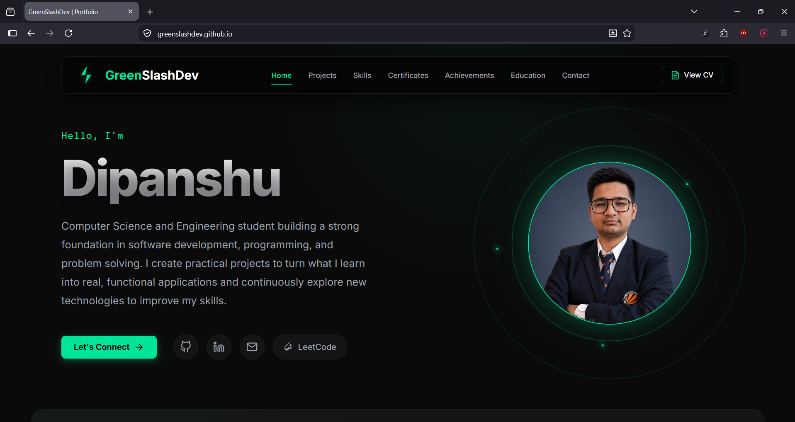

# Dipanshu — Personal Portfolio

A responsive personal portfolio website showcasing my projects, technical skills, education, certifications, achievements, and professional profile.



## 🌐 Live Website

**[Visit my portfolio](https://greenslashdev.github.io/)**

## ✨ Features

- 📱 Fully responsive design for mobile, tablet, and desktop
- 💻 Project showcase with live demos and source code
- 🤖 AI-assisted projects section
- 📜 Interactive certificate viewer
- 📄 PDF CV viewer with zoom controls
- ⬇️ Downloadable CV
- 📬 Contact form powered by Formspree
- 🧭 Smooth section-based navigation
- ⚡ Fast Vite-powered development and production builds
- 🚀 Automated deployment through GitHub Actions and GitHub Pages

## 🛠️ Tech Stack

- **React**
- **JavaScript**
- **HTML5**
- **CSS3**
- **Vite**
- **Git & GitHub**
- **GitHub Actions**
- **GitHub Pages**
- **Formspree**

## Highlights

- Improved responsiveness across mobile, tablet, and desktop.
- Fixed narrow-screen overflow issues.
- Improved Hero section scaling.
- Improved navigation on small screens.
- Improved project and contact button wrapping.
- Optimized CV viewer controls for mobile.

## Validation

- Tested on mobile devices
- Tested on tablet
- Production build verified with `npm run build`

## 📂 Project Structure

```text
greenslashdev.github.io/
├── .github/workflows/    # GitHub Actions deployment workflow
├── public/               # Static assets and portfolio resources
│   ├── certificates/     # Certificate images
│   ├── projects/         # Project showcase images
│   └── ...
├── src/
│   ├── components/       # Reusable React components
│   ├── sections/         # Portfolio sections and their styles
│   ├── App.jsx           # Root application component
│   ├── index.css         # Global styles
│   └── main.jsx          # Application entry point
├── CHANGELOG.md          # Version history and release notes
├── README.md             # Project documentation
├── index.html            # HTML entry point
├── package.json          # Project metadata and dependencies
├── package-lock.json     # Locked dependency versions
└── vite.config.js        # Vite configuration